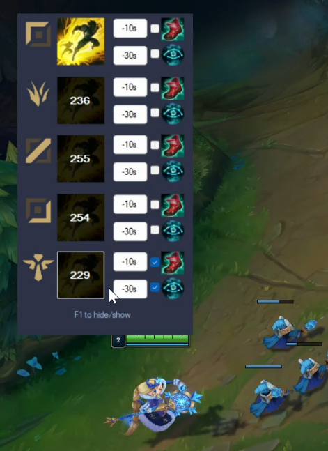

# 707.F

707.F is an in-game overlay Flash cooldown timer for popular game League of Legends.

The developer of this app (yes it's me) is a sole rank Master player (support main).

[中文介绍](#应用介绍)

## Screenshot

## In-game Demo

TODO

## Features 

- It doesn't use riot API. It doesn't automatically detect anything. It requires user to click on the button to start the flash cooldown timers. 

- There're 3 buttons that can start the flash timer for each enemy. Click the "flash icon" means this enemy just used flash. Button "-10s" and"-30s" means this enemy used flash 10/30 seconds ago. 

- Flash Expert: There're 2 checkboxes for each enemy that refers to the rune "Cosmic Insight" and the item "Ionion Boots of Lucidity". If user checks one or two of those checkboxes, the corresponding enemy's timer will be adjusted to correct cooldown value.

- Hide/Show: click "F1" to hide/show the window. 

**You need to set the display mode of League of Legend Client to be `borderless` instead of `full screen`, otherwise everytime you click "F1", you will be forced back to the desktop.**

## Changelog 
- 2022/8/22 
Version 1.0 released. Submitted the app to riot. Waiting for response.
- 2022/9/2
**Version 1.0 is APPROVED by Riot.** The next step is to do the in-game testing.
- 2022/9/6
Version 1.0.1 released. Submitted it to [Microsoft Malware Analysis](https://www.microsoft.com/en-us/wdsi/filesubmission).
- 2023/4/28
Version 1.1.0 released. Submitted it to Riot. Waiting for response.
- 2023/5/7
Version 1.1.0 is rejected due to the new Easy Print feature. Please use Version 1.0.1.
- 2023/6/18
Version 1.2 realeased. Submitted it to Riot. Waiting for response.
- 2023/6/22
- Version 1.2 is rejected. I don't know why. Submit version 1.2.1 which uses a different app logo.

## Download
https://github.com/epigone707/LeagueSumTimer/releases/download/1.0.1/707FlashTimer.exe (Version 1.0.1, approved by Riot)

## Legal
The app isn't endorsed by Riot Games and doesn't reflect the views or opinions of Riot Games or anyone officially involved in producing or managing Riot Games properties. Riot Games, and all associated properties are trademarks or registered trademarks of Riot Games, Inc.

# 应用介绍

707.F是为英雄联盟设计的闪现技能计时器。它将在游戏内覆盖显示，可以用快捷键快速隐藏或显示窗口。

## 功能

- 本应用不使用拳头API。它不会自动识别任何游戏物件。它需要用户点击按钮生效。

- 每一个敌人都有一个闪现计时器。

- 对于每个敌人，有三个按钮可以让闪现计时器开始计时。按钮1 (闪现图标) 表示这名敌人刚刚使用了闪现。按钮2 "-10s" 表示这名敌人10秒前使用了闪现。按钮3 "-30s" 表示这名敌人30秒前使用了闪现。

- 对于每个敌人，有两个勾选框，分别代表 符文 “星界洞悉” 和 装备 “明朗之靴（CD鞋）”。 用户勾选对应的勾选框后，本应用将缩短对应敌人的闪现总CD时间，来保证不会出现错误的计时。

- 按下“F1”快捷键，可快速隐藏/显示应用。

**注意：请将英雄联盟客户端显示模式设置成“无边框”。如果使用“全屏”显示模式，当你按下“F1”快捷键时会被强制返回桌面**
