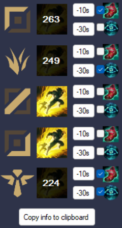

# 707FlashTimer
707FlashTimer is an in-game overlay Flash cooldown timer for popular game League of Legends. 

[中文介绍](#应用介绍)

## Screenshot

## In-game Demo

TODO

## Features 

It doesn't use riot API. It doesn't automatically detect anything. It requires user to click on the button to start the flash cooldown timers. 

There's a flash timer for each enemy. 

There're 3 bottons that can start the flash timer for each enemy. Botton 1 "flash icon" means this enemy just used his/her flash. Botton 2 "-10s" means this enemy used his/her flash 10 seconds ago.  Botton 3 "-30s" means this enemy used his/her flash 30 seconds ago. 

There're also two checkboxes for each enemy that refers to the rune "Cosmic Insight" and the item "Ionion Boots of Lucidity". If user checks one or two of those checkboxes, the corresponding enemy's timer will be adjusted to correct cooldown value.

The product can generate a string text containing the enemies' flash cooldown info to user's clipboard， if the user click the button "Copy info to clipboard". One example of the string text is "Flash cooldown remains: top 298s; bot 269s; "

User can click "F1" to hide/show the product window.

## Changelog 
- 2022/8/22 
Completed version1.0. Submitted the app to riot. Waiting for response.
- 2022/9/2
The app is approved by Riot. The next step is to do the in-game testing.

# 应用介绍

707FlashTimer是为英雄联盟设计的闪现技能计时器。它将在游戏内覆盖显示，可以用快捷键快速隐藏或显示窗口。

## 功能

本应用不使用拳头API。它不会自动识别任何游戏物件。它需要用户点击按钮生效。

每一个敌人都有一个闪现计时器。

对于每个敌人，有三个按钮可以让闪现计时器开始计时。按钮1 (闪现图标) 表示这名敌人刚刚使用了闪现。按钮2 "-10s" 表示这名敌人10秒前使用了闪现。按钮3 "-30s" 表示这名敌人30秒前使用了闪现。

对于每个敌人，有两个勾选框，分别代表 符文 “星界洞悉” 和 装备 “明朗之靴（CD鞋）”。 用户勾选对应的勾选框后，本应用将缩短对应敌人的闪现总CD时间，来保证不会出现错误的计时。

在应用的最下方有一个"Copy info to clipboard"按钮，按下后，本应用会将一串字符复制到用户的剪贴板。用户可以直接在游戏内的聊天框按下ctrl+v，将这串字符发送给全体队友。这串字符包含了所有敌人当前的闪现剩余时间。例如，"Flash cooldown remains: top 298s; bot 269s; "代表对方上单闪现还有298秒，对方ADC还有269秒。

按下“F1”快捷键，即可快速隐藏/显示应用。

## 更新日志
- 2022/8/22 
完成1.0版本。已将应用提交给拳头官方审核。等待回复。
- 2022/9/2
已通过拳头官方审核。下一步是游戏内测试。
